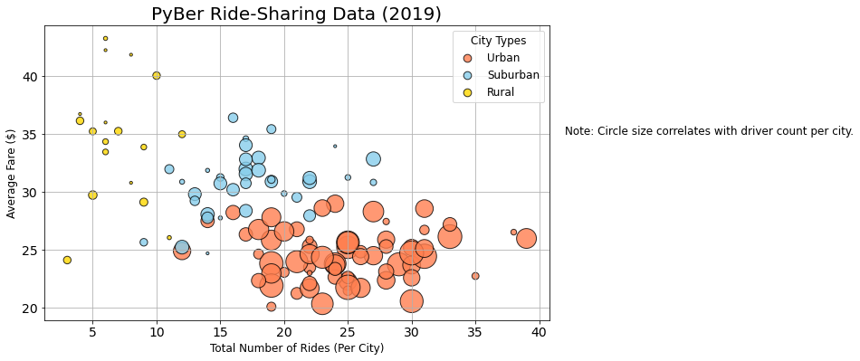
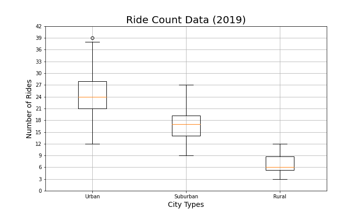

# PyBer Analysis with Matplotlib

## Overview of Analysis Project
An exploratory analysis was performed to capture information such as total rides, total drivers, and total fare per city type. After displaying this data in charts (bubble, pie, and whisker-and-plot), data was then collected to determine the total weekly fares per city type by creating a Summary DataFrame and displayed in a multiline graph.

## Purpose of Analysis
-From the information above, charts using Matplotlib will be created, formatting will be performed on those charts to clearly and neatly display the data in an organized fashion.

-Measures of Central Tendency (mean, median, and mode) will be used in calculations to help find averages and perform other calculations to help relate the data.

## Resources
-CSV Files:
1. `city_data.csv`
2. `ride_data.csv`

-Dependencies:
1. Pandas Library
2. NumPy
3. SciPy Statistics

## Results
### PyBer Ride-Sharing Data Bubble Chart
The PyBer bubble chart below shows the relationship between the Total Number of Rides per city type and the Total Number of Drivers per city type in conjunction with the Average Fare per City. The bubbles show that as the number of rides increase in the given city type, the fare rate tends to decrease. As for the driver count per city, the bubble seems to get larger when the average fare decreases or when the total number of rides increase.

### PyBer Ride-Sharing Data Box-and-Whisker Plot
The below Box-and-Whisker Plot shows the Ride Counts per city type to include outlier data for each city. For example, the Urban city type has an outlier of 39 rides.

### PyBer Ride-Sharing Data Pie Charts
#### Percentage of Total Fares by City Type
The pie chart below represents the Percentage of Total Fares by city type. Urban has the highest percentage at 62.7%, followed by Suburban at 30.5% and Rural at 6.8%.

#### Percentage of Total Rides by City Type
The pie chart below represents the Percentage of Total Rides per city type. Urban has the highest percentage at 68.4%, followed by Suburban at 26.3% and Rural at 5.3%.

#### Percentage of Total Drivers by City Type
The pie chart below represents the Percentage of Total Drivers per city type. Urban has the highest percentage at 80.9%, followed by Suburban at 16.5% and Rural at 2.6%.

### Summary DataFrame
After merging the data sets from the `city_data.csv` and the `ride_data.csv`, a Summary DataFrame was created using the `groupby()` function to display Average Fare per Ride and Average Fare per Driver displayed per city type.

Below is a multiline chart to represent the data from the Summary DataFrame in reference to the total weekly fares by city type from the dates 01/01/2019 through 04/29/2019.

## Summary
Based on the results from the data above, further recommendations can be made to address some disparities found among the city types:
1. Keeping in mind that the data above only shows an analysis of January through April of 2019, it would be more beneficial to get information for a full year to better understand why the data has changed. For example, there may be certain times of the year where ride-sharing occurs (holidays, communting to work on weekdays, etc.), so some times such as the weekend where people don't commute to work and holidays may be busier than normal or not busy at all as some may fly places.
2. Another set of data could be added to include the age groups that used the ride-share platform. From there you can gather data on certain areas where people are more likely to ride-share and thus improve business.
3. Because the Rural city type was such a small percentage of the actual data, it might be a good idea to gather more information about mileage and the fare rate and get results to help come to a conclusion if the fare rate is fair or if it needs to be increased or in some areas are made not available for ride-share.
